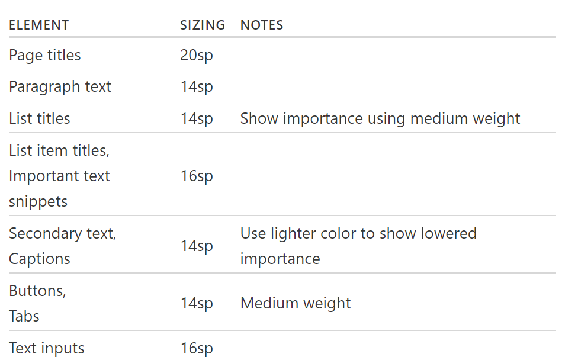

## App & Web Design Systems  
Define a restrictive type scale in advance and use that to make any future
font size decisions.  
1. Font size. For iOS, use text size that’s at least 11 points, while for Android, choose 14 sp for main text.
2. Font weight
3. Line height
4. Color
5. Margin
6. Padding
7. Width
8. Height
9. Box shadows
10. Border radius
11. Border width Opacity  

**Typography:** This term refers to the technique used in styling, formatting, and arranging “printed” (as opposed to handwritten) text.  
**Typeface:** This is the classification system used to label a family of characters. So, this would be something like Arial, Times New Roman, Calibri, Comic Sans, etc.  
**Font:** This drills down further into a website’s typeface. The font details the typeface family, point size, and any special stylizations applied. For instance, 11-point Arial in bold.  
**Font Weight:** This is the other part of defining a typeface as a font. Weight refers to any special styles applied to the face to make it appear heavier or lighter.  
**Kerning:** This pertains to the space between two letters. It can be adjusted in order to create a more aesthetically pleasing result while also enhancing readability. You will need a design software like Photoshop to make these types of adjustments.  
**Tracking:** Tracking, or letter-spacing, is often confused with kerning as it too relates to adding space in between letters. However, whereas kerning adjusts spacing between two letters in order to improve *appearances*, tracking is used to adjust spacing **across a line**. This is used more for the purposes of fixing density issues while reading. Tracking will affect the number of works in a single line for readability.  
Leading: Leading, or line spacing, is the amount of distance granted between the baselines of text (the bottom line upon which a font rests). Like tracking, this can be adjusted to fix density issues. 

Short, glanceable strings of text lead to faster reading and greater comprehension when:  
1. They are larger in size (specifically, 4mm as opposed to 3mm).
2. They are in all caps.
3. Lettering width is regular (and not condensed). 

A contrast of 4.5 to 1 should be established between the text and background for optimal readability. There are a few exceptions to the rule:  
1. Text sized using 18-point or a bold 14-point only needs a contrast of 3 to 1.  
2. Text that doesn’t appear in an active part of the web page doesn’t need to abide by this rule.  
3. The contrast of text within a logo can be set at the designer’s discretion.  

If you’re unsure of how to establish that ratio between your font’s color and the background upon which it sits, use a color contrast checking tool like [WebAIM.](https://webaim.org/resources/contrastchecker/)  
Be mindful of s using opacity or other color settings that may compromise the color you’ve chosen. While the HEX color code will check out just fine in the tool, it may not be an accurate representation of how the color actually displays on a mobile device (or any screen, really).  
To solve this problem and ensure you have a high enough contrast for your fonts, use a color eyedropper tool built into your browser like the ones for Firefox or Chrome. Simply hover the eyedropper over the color of the background (or font) on your web page, and let it tell you what the actual color code is now. 
### Font size
minimum font for body text to 16sp to 18sp(Roboto) for android and 17pt for iOS.  
fonts with thiner strokes require large font size for body text.  
#### Headline text  
headline to be contrasting but 2-3 lines only.  
for body text use system default font and use another font for headlines/titles.  
  
Use a text input font size of at least 16px.  
Secondary text should be about 2 sizes smaller than your paragaph text. like lesser labels, captions, etc. – use a size a couple notches smaller – such as 13px or 14px. I do NOT recommend going down just one font size, since then it’s too easy to confuse with normal text. In addition, when text is less important, you want to style it so that you’re clearly communicating the lesser importance – often using, say, a lighter shade of gray (something about 70% as strong is a good place to start).  
Always view your designs on an actual device.  
Material Design’s default font size is 16px Roboto and secondary font size is 14px.  
iOS’s default font size is 17px SF Pro and secondary font size is 15px.  
### Desktop Web Typography Guidelines  
#### Text-heavy pages.  
Articles, blogs, news, etc. These are pages where the primary purpose the user has on the page is to read. There is very little in terms of interaction – perhaps just clicking a few links.  
16px – absolute minimum for text-heavy pages
18px – a better font size to start with. You’re not printing out a single-spaced Word document; you’re writing for people sitting a couple feet from their decade-old monitors.
20px+ – may feel awkwardly large at first, but is always worth trying out in your design app. The best-looking text-heavy site on the web, Medium.com, has a default article text size of 21px.
#### Interaction-heavy pages.  
Apps that involve more hovering, clicking, searching for an item in a list or table, editing, typing, etc. There may be plenty of text on the page, but it’s not stuff you read straight through like a book.  
Instead, 14px-16px is the norm.  
##### 1. Header font size.  
This is the biggest font size on your page. Use it for the headline or section titles. If you have both a headline and section titles, you should almost certainly be using two different font sizes here.
##### 2. Default font size.  
This is the most common font size on your page, and should be used for all body text – as well as most controls, like text boxes, dropdowns, buttons, and menus. The key header mistake beginning designers make here is to use many font sizes for elements that should all be one font size.
##### 3. Secondary font size.  
This is a font size – usually about 2pt smaller than your default font size – that you use for less-important details of the site. Supporting information and stats, sometimes captions, etc.  
##### 4. Tertiary/caption/label/wildcard font size  
### fonts combinations  
Heading & body text  
1. NUNITO & SOURCE SERIF PRO
2. Expletus Sans & Hind  
3. IBM Plex Serif & IBM Plex Sans  
4. Epilogue (Bold & Regular)  
5. Red Hat Display (Bold & Regular)  
6. Fraunces & Commissioner  
7. Libre Baskerville and Roboto  
8. Lexend Deca (Bold & Regular)---xxxx---  
9. Poppins (Bold & Regular)  
10. Roboto & Libre Franklin  
11. JetBrains & IBM Plex  
12. Barlow (Bold & Regular)  
13. Vollkorn & Open Sans  

Minimum body text size is 24dp – reserve subtext sizes for non-crucial information. Use medium font weights in a restricted manner – and avoid bold. While the smallest body text size for Android Auto is 24dp, subtext type sizes below 24dp can be used sparingly. Because this subtext size is not easily glanceable, it should be reserved for non-crucial information, such as status bar content.  
Google Sans should be used for type sizes 32dp and larger. Roboto is used everywhere else because it is legible in smaller sizes. When using a display font best suited to large text, such as Google Sans, keep it at type sizes of 32dp or larger. Use Roboto for smaller, secondary text because it maintains good legibility at sizes below 32dp.  
  
Use the medium font weight sparingly. Save it for when you need to emphasize the primary or active text, such as the Recents tab in this example, or to establish visual hierarchy.  
#### TRACKING
Plain and simple: tracking in mobile web design needs to be used in order to control density. The standard recommendation is that there be no more than between 30 and 40 characters to a line. Anything more or less could affect readability adversely.  

content that appears above the fold on a 30-inch desktop monitor equates to five swipes on a 4-inch mobile device.  
a mobile session, on average, usually lasts about only 72 seconds. Compare that to desktop at 150 seconds.  
This means two things for you:  
1. You absolutely need to cut out the excess on mobile. If this means creating a completely separate and shorter set of content for mobile, do it.  
2. Be very careful with leading.  

Too much **leading** and you could unintentionally be asking users to scroll even more than they might have to.  
And with every scroll comes the possibility of fatigue, boredom, frustration, or distraction getting in the way.  
So, you need to strike a good balance here between using line spacing to enhance readability while also reigning in how much work they need to do to get to the bottom of the page.  
Guidelines on how to create spacing for mobile devices. I’ve seen suggestions for anywhere between 120% to 150% of the font’s point size. Since you also need to consider accessibility when designing for mobile, I’m going to suggest you follow WCAG’s guidelines:  
1. Spacing between lines needs to be 1.5 (or 150%, whichever ratio works for you).
2. Spacing between paragraphs then needs to be 2.5 (or 250%).  

#### Recommendations  
1. Don’t be afraid to start with a system default font. They’re going to be your safest choices until you get a handle on how far you can push the limits of mobile typography.  
2. Use only a sans serif or serif font. If your desktop website uses a decorative or handwritten font, ditch it for something more traditional on mobile. That said, you don’t have to ignore decorative typefaces altogether. 
3. Never use more than two typefaces on mobile. There just isn’t enough room for visitors to handle that many options visually. Make sure your two typefaces complement one another. Specifically, look for faces that utilize a similar character width. The design of each face may be unique and contrast well with the other, but there should still be some uniformity in what you present to mobile visitors’ eyes.  
4. Avoid typefaces that don’t have a distinct set of characters. For instance, compare how the uppercase “i”, lowercase “l” and the number “1” appear beside one another.  
5. Also, be sure to review how your font handles the conjunction of “r” and “n” beside one another. Can you differentiate each letter or do they smoosh together as one indistinguishable unit? Mobile visitors don’t have time to stop and figure out what those characters are, so make sure you use a typeface that gives each character its own space.  
6. Use fonts that are [compatible across as many devices](https://jordanm.co.uk/tinytype/) as possible. Your best bets will be: Arial, Courier New, Georgia, Tahoma, Times New Roman, Trebuchet MS and Verdana.  
7. When you’re feeling comfortable with mobile typography and want to branch out a little more, take a look at this list of the [best web-safe](https://websitesetup.org/web-safe-fonts-html-css/) typefaces from WebsiteSetup. You’ll find here that most of the choices are your basic serif and sans serif types. It’s definitely nothing exciting or earth-shattering, but it will give you some variation to play with if you want to add a little more flavor to your mobile type.  
#################################################--------------------------------------#####################################  
**Roboto** and **Noto** are the standard typefaces on Android and Chrome.  
Roboto is the standard typeface on Android.  
Noto is the standard typeface for all languages on Chrome and Android for all languages not covered by Roboto.  
##### App bar  
Title style, Medium 20sp  
##### Buttons  
*English:* Medium 14sp, all caps  
*Dense:* Medium 15sp, all caps  
*Tall:* Bold 15sp  
##### Subheading  
*English:* Regular 16sp (device), 15sp (desktop)  
*Dense:* Regular 17sp (device), 16sp (desktop)  
*Tall:* Regular 17sp (device), 16sp (desktop)  
##### Body 1  
*English:* Regular 14sp (device), 13sp (desktop)  
*Dense:* Regular 15sp (dense), 14sp (desktop)  
*Tall:* Regular 15sp (device), 14sp (desktop)  
##### Text contrast ratios
*Minimum:* 4.5:1  
*Preferred:* 7:1  

Use a single typeface and a few font variants and sizes.  
Use built-in text styles whenever possible. The built-in text styles let you express content in ways that are visually distinct, while retaining optimal legibility. These styles are based on the system fonts and allow you to take advantage of key typographic features, such as Dynamic Type, which automatically adjusts tracking and leading for every font size.  
Leading is the space between lines. In design, the standard leading should be 120% the point size of the font. Another common used tip: short line length requires less leading.  
Keep the number of character per line within 30–40 is a good choice.  
Space in mobile typography mainly contains: space between lines, space in the margins, paragraph space. Proper space in mobile typography can help user better interact with the text. Designers can consider to start in the 10 to 20 percent range. Do not make the area of space too much for the mobile screen is not large, or you are waste the room.  

  
Mobile screens have a more limited space, so many designers apply only 2 levels. A headline and a body is enough, headlines is to grab the reader instantly and the body toward readability.  

Left side alignment is the best choice of the rest 3. It can resulting in a ragged right edge, which allows user’s eyes jump from one end of a line to the next consistently. use left side alignment; while for the title or short lines, centered looks good.  

On a mobile, we usually have some actions like purchasing products, make a order or book a ticket. Functional typography should be highlighted among the other and clickable elements should be big enough to tap on them.  

It’s requirement for designers to consider how mobile typography will look on different devices.  

Paragraphs may also need to be represented at different sizes. Generally three different sizes may be required, a regular paragraph size, then a larger size for an introductory or lead paragraph, and then a smaller size for things like footnotes for example. Consider using token names like text-small, text-medium or text-large or using the common t-shirt size metaphor text-s, text-m and text-l.  

You may use a h2 title on a card at one size, and h2 within an article page, but represented at a different size. Both may have the same hierarchy, but their use case is very different.  
It’s not enough to pick your font sizes and assign them to headings like h1 or h2 —assign your sizes to tokens. Why? In HTML coding, the heading tags from h1 to h6 give semantic hierarchy for SEO, they do not represent text size.  

Typically, heavier font weights are used for headings and titles, and lighter font weights for paragraphs. Be cautious though when using light font weights on smaller text, as this could lead to accessibility issues.

For a more polished typography system, instead of choosing one weight for headings, and a second for body copy, spend a little more time picking font weights for each different heading size that best compliment the overall hierarchy of your type.  

Be cautious when choosing font weights, every additional weight you add, adds to the download size.  

A good trick to measure the ideal line length is by using the letters of alphabet, if the alphabet fits within the space between two and three times, you’re in the safe zone.  
  
The ideal line length on mobile would be in the range of 35 to 40 characters per line.  

Some modern design applications like Photoshop still use the term ‘leading’, while in HTML and CSS, the attribute is called ‘line-height’. Leading, line spacing and line height all refer to the same thing.  
Line height, or line spacing, is commonly measured as a percentage of font size. Conventional wisdom is that line spacing of 130%-150% is ideal for readability, but even up to 200% is acceptable.  

Line spacing as a % should actually increase with smaller font sizes. This is because smaller fonts are already more difficult to read, and need more space around them for the eye to easily follow.  
1. Aim for about 140%-180% for optimal readability and accessibility.  
2. Limit line length to 70–80 characters.
3. Font size should be a minimum of 16pt.
4. Small fonts need more spacing.
5. Experiment with tighter spacing on pull quotes or other short texts.
6. Check your line spacing when you change font or font size.  
7. Capital letters — It’s almost always a good idea to increase letter-spacing with uppercase type.  
8. Large text (e.g., titles and headings) should have decreased letter-spacing.
9. Body text should have default tracking, or stick very close to default letter-spacing.
10. Very small text should have increased letter-spacing.
11. Light-on-dark text — Light type set on a dark background usually benefits from a small increase in letter-spacing.
12. Font weight — Like with font size, the relationship between font weight and letter-spacing follows a simple pattern: as weight increases, letter-spacing decreases, and as weight decreases, letter-spacing increases.  

The capitalisation shouldn’t be used where reading long text is required. Use capital text in places such as tabs where user attention is important. A basic rule is to only use uppercase letters in headers, captions, or other UI labels where text length is shorter than one line.  
**Title case** — this is the practice of making the first letter of each word upper-case. Typically it is recommended to only use this in the case of headlines and possibly labels.  Apple’s design guidelines recommend title case for many UI elements, including alert titles, menu items, and buttons.  
**Sentence case** — With sentence case, you capitalize the first letter of the sentence (and any proper nouns). Sentence case looks casual, cleaner, improves readability and nobody ever complained that sentence case caused them any loss of business. Google’s Material Design follows it earnestly.  
However you decide to deal with your letter casing, one key take away is to remain consistent on how it is applied throughout your design system.  
**Font-style**
What I am referring to is the style applied to text; like bold, italics and underlines.  
1. Bold or italic — think of them as mutually exclusive.  
2. Use bold and italic as little as possible — They are tools for emphasis. But if everything is emphasized, then nothing is emphasized.  
3. With a serif font, use italic for gentle emphasis, or bold for heavier emphasis.  
4. If you’re using a sans serif font, skip italic and use bold for emphasis — most sans serif italic fonts just have a gentle slant that doesn’t stand out on the page.  

When it comes to underlines, reserve this exclusively for links. Since the beginning of the web, underlines have been used on links, if you use them for any other reason, users will expect them to be clickable.  
If you use REMs, set your base font size up on the root element. On web, this would be on the body tag. All other font sizes then become a multiple of this base font size. Your base font size will always equate to 1rem. e.g  
- If you set base font to 16px, 1rem equals 16px.
- Represented in units, fonts would then look something like this:
- Paragraph = 1rem (16px)
- Heading 1 = 2.5rem (40px)
- Heading 2 = 2rem (32px)
- Heading 3 = 1.5rem (24px)
- line-height = 1.5rem (24px)  

1. Pick your base font colour (usually black or close to black) and then any overrides for specific use cases like alerts messages.
2. Assign a specific colour to links.
3. Decide on specific colour applications for components. For example, a button could possibly use a tint from the base button colour.
4. Consider text that needs to appear on dark and light backgrounds.  

***Accessibility*** is the inclusive practice of ensuring there are no barriers that prevent interaction with, or access to, websites on the World Wide Web by people with disabilities. When sites are correctly designed, developed and edited, generally all users have equal access to information and functionality.  
1. Font size — i.e body copy should not be smaller than 16px
2. Font colour — always consider colour contrast
3. Font weight — i.e lighter fonts can be hard to read at small sizes
4. Letter-spacing — tighter spacing on large text and broader spacing on small text can improve accessibility
5. Line height — visually impaired people will find copy hard to read if the line-height is set to 100% or large spacing like 250%
6. Letter-case — i.e. don’t use all-caps for body copy.  

Not having a consistent unit of measurement can lead to layout inconsistencies between pages, particularly on projects with two or more designers. The “system” is only good if it is easy to follow and repeat.  
#### 8 Point Grid Sytem  
There are many ways to define your measurement units, my recommendation would be to use multiples of eight. Why eight you ask? Well eight is divisible by 2 and 4. This becomes important when considering displays that multiply pixel sizes due to higher resolutions. For example, a resolution of 1.5 would multiply 5px by this number resulting in a half pixel offset — The result is an edge that appears blurred, caused by the antialiasing of that half pixel. Half pixels don’t happen on an 8pt grid system.  
A point (pt) is a measurement of space that is dependent on screen resolution. The simplest explanation is that at a “1x” resolution (or @1x), 1pt = 1px.
At a “2x” resolution (@2x), 1pt = 4px because resolution doubles on both the X and Y axes making it 2px wide by 2px tall (2px x 2px).
At a “3x” resolution (@3x), 1pt = 9px (3px x 3px) and so on.  
Scaling by increments of 8 offers a good amount of options without overloading you with variables like a 6 point system, or limiting you like a 10 point system. Ultimately you have to decide what size is right for your audience.  
#### Scale  
An alternate approach to multiples of 8 is to use a scale. Spacing where the increments between spaces are based on a ratio. A popular scale to use is the Fibonacci sequence, a scale which occurs throughout nature. f the 8 point grid system appeals to you, identify a modular scale, pick the sizes closest to a multiple of 8 or 4 and use that to inform your spacing elements (rounding the sizes to the nearest multiple of 8).  
##### The three general typography system archetypes:  
**Marketing** — Built to tell a specific story and inspire visitors to spend their time and/or money on the site. White space is embraced, often more dramatic, utilising a larger scale ratio, resulting in more dramatic gaps between spacing elements.
**Editorial** — To convey a large amount of information. Spacing is usually less dramatic in this cases with tighter spacing compared to the marketing archetype.
**Data** — Built to solve a user problem like filing taxes, managing a git repo, or visualizing performance metrics. Spacing here can often be much tighter due to large amounts of data that need to be presented, the ratio between spacing is often much smaller than the two other archetypes mentioned above.  

The great thing about EMs and REMs is they are abstract and based on a font-size. So, 1em or 1rem could translate into 16px or 160px, depending on the font sizes.  
When using em units, the pixel value you end up with is a multiplication of the font size of the element being styled. For example, if a div has a font size of 18px, 10em would equate to 180px, i.e. 10 x 18 = 180.  
When using REM units, the pixel size they translate to depends on the font size of the root element of the page, i.e. the HTML element. That root font size is multiplied by whatever number you’re using with your REM unit. For example, with a root element font size of 16px, 10rem would equate to 160px, i.e. 10 x 16 = 160.  
Set the base font size upfront and then do the math, developing the px to REM ratio in line with your scale. Example: If you set base font to 16px, 1rem equals 16px.  
Abstracting your values out into named tokens helps eliminate confusion. It provides a common language both designers and developers can use. Designers can still design using pixels, and developers can code in REMs, while the integrity of the system remains intact.  
Two common naming conventions for tokens in this case are:
1. Following a numeric sequence (space-1, space-2, space-3, etc.)
i.e.
space-1= 16px and 1rem
space-2= 24px and 1.5rem
space-3= 32px and 2rem
etc…
2. Using the convention of T-shirt sizes (xs, s, m, l, xl, etc.)
i.e.
space-s= 16px and 1rem
space-m= 24px and 1.5rem
space-l= 32px and 2rem
etc…  

