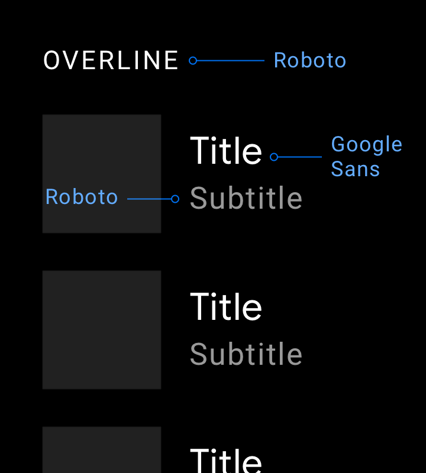

## App & Web Design Systems  
Define a restrictive type scale in advance and use that to make any future
font size decisions.  
**Typography:** This term refers to the technique used in styling, formatting, and arranging “printed” (as opposed to handwritten) text.  
**Typeface:** This is the classification system used to label a family of characters. So, this would be something like Arial, Times New Roman, Calibri, Comic Sans, etc.  
**Font:** This drills down further into a website’s typeface. The font details the typeface family, point size, and any special stylizations applied. For instance, 11-point Arial in bold.  
**Font Weight:** This is the other part of defining a typeface as a font. Weight refers to any special styles applied to the face to make it appear heavier or lighter.  
**Kerning:** This pertains to the space between two letters. It can be adjusted in order to create a more aesthetically pleasing result while also enhancing readability. You will need a design software like Photoshop to make these types of adjustments.  
**Tracking:** Tracking, or letter-spacing, is often confused with kerning as it too relates to adding space in between letters. However, whereas kerning adjusts spacing between two letters in order to improve *appearances*, tracking is used to adjust spacing **across a line**. This is used more for the purposes of fixing density issues while reading. Tracking will affect the number of works in a single line for readability.  
Leading: Leading, or line spacing, is the amount of distance granted between the baselines of text (the bottom line upon which a font rests). Like tracking, this can be adjusted to fix density issues.  
Short, glanceable strings of text lead to faster reading and greater comprehension when:

1. They are larger in size (specifically, 4mm as opposed to 3mm).
2. They are in all caps.
3. Lettering width is regular (and not condensed).  
A contrast of 4.5 to 1 should be established between the text and background for optimal readability. There are a few exceptions to the rule:  
1. Text sized using 18-point or a bold 14-point only needs a contrast of 3 to 1.  
2. Text that doesn’t appear in an active part of the web page doesn’t need to abide by this rule.  
3. The contrast of text within a logo can be set at the designer’s discretion.
If you’re unsure of how to establish that ratio between your font’s color and the background upon which it sits, use a color contrast checking tool like [WebAIM.](https://webaim.org/resources/contrastchecker/)  
Be mindful of s using opacity or other color settings that may compromise the color you’ve chosen. While the HEX color code will check out just fine in the tool, it may not be an accurate representation of how the color actually displays on a mobile device (or any screen, really).  
To solve this problem and ensure you have a high enough contrast for your fonts, use a color eyedropper tool built into your browser like the ones for Firefox or Chrome. Simply hover the eyedropper over the color of the background (or font) on your web page, and let it tell you what the actual color code is now.  

1. Font size
2. Font weight
3. Line height
4. Color
5. Margin
6. Padding
7.  Width
8.   Height
9.   Box shadows
10.    Border radius
11.    Border width
12.    Opacity
### Font size
minimum font for body text to 16sp to 18sp(Roboto) for android and 17pt for iOS.  
fonts with thiner strokes require large font size for body text.  
#### Headline text  
headline to be contrasting but 2-3 lines only.  
for body text use system default font and use another font for headlines/titles.  
  
Use a text input font size of at least 16px.  
Secondary text should be about 2 sizes smaller than your paragaph text. like lesser labels, captions, etc. – use a size a couple notches smaller – such as 13px or 14px. I do NOT recommend going down just one font size, since then it’s too easy to confuse with normal text. In addition, when text is less important, you want to style it so that you’re clearly communicating the lesser importance – often using, say, a lighter shade of gray (something about 70% as strong is a good place to start).  
Always view your designs on an actual device.  
Material Design’s default font size is 16px Roboto and secondary font size is 14px.  
iOS’s default font size is 17px SF Pro and secondary font size is 15px.  
## Desktop Web Typography Guidelines  
#### Text-heavy pages.  
Articles, blogs, news, etc. These are pages where the primary purpose the user has on the page is to read. There is very little in terms of interaction – perhaps just clicking a few links.  
16px – absolute minimum for text-heavy pages
18px – a better font size to start with. You’re not printing out a single-spaced Word document; you’re writing for people sitting a couple feet from their decade-old monitors.
20px+ – may feel awkwardly large at first, but is always worth trying out in your design app. The best-looking text-heavy site on the web, Medium.com, has a default article text size of 21px.
#### Interaction-heavy pages.  
Apps that involve more hovering, clicking, searching for an item in a list or table, editing, typing, etc. There may be plenty of text on the page, but it’s not stuff you read straight through like a book.  
Instead, 14px-16px is the norm.  
##### 1. Header font size.  
This is the biggest font size on your page. Use it for the headline or section titles. If you have both a headline and section titles, you should almost certainly be using two different font sizes here.
##### 2. Default font size.  
This is the most common font size on your page, and should be used for all body text – as well as most controls, like text boxes, dropdowns, buttons, and menus. The key header mistake beginning designers make here is to use many font sizes for elements that should all be one font size.
##### 3. Secondary font size.  
This is a font size – usually about 2pt smaller than your default font size – that you use for less-important details of the site. Supporting information and stats, sometimes captions, etc.  
##### 4. Tertiary/caption/label/wildcard font size  
## fonts combinations  
Heading & body text  
1. NUNITO & SOURCE SERIF PRO
2. Expletus Sans & Hind  
3. IBM Plex Serif & IBM Plex Sans  
4. Epilogue (Bold & Regular)  
5. Red Hat Display (Bold & Regular)  
6. Fraunces & Commissioner  
7. Libre Baskerville and Roboto  
8. Lexend Deca (Bold & Regular)---xxxx---  
9. Poppins (Bold & Regular)  
10. Roboto & Libre Franklin  
11. JetBrains & IBM Plex  
12. Barlow (Bold & Regular)  
13. Vollkorn & Open Sans  

Minimum body text size is 24dp – reserve subtext sizes for non-crucial information. Use medium font weights in a restricted manner – and avoid bold. While the smallest body text size for Android Auto is 24dp, subtext type sizes below 24dp can be used sparingly. Because this subtext size is not easily glanceable, it should be reserved for non-crucial information, such as status bar content.  
Google Sans should be used for type sizes 32dp and larger. Roboto is used everywhere else because it is legible in smaller sizes. When using a display font best suited to large text, such as Google Sans, keep it at type sizes of 32dp or larger. Use Roboto for smaller, secondary text because it maintains good legibility at sizes below 32dp.  
  
Use the medium font weight sparingly. Save it for when you need to emphasize the primary or active text, such as the Recents tab in this example, or to establish visual hierarchy.  

